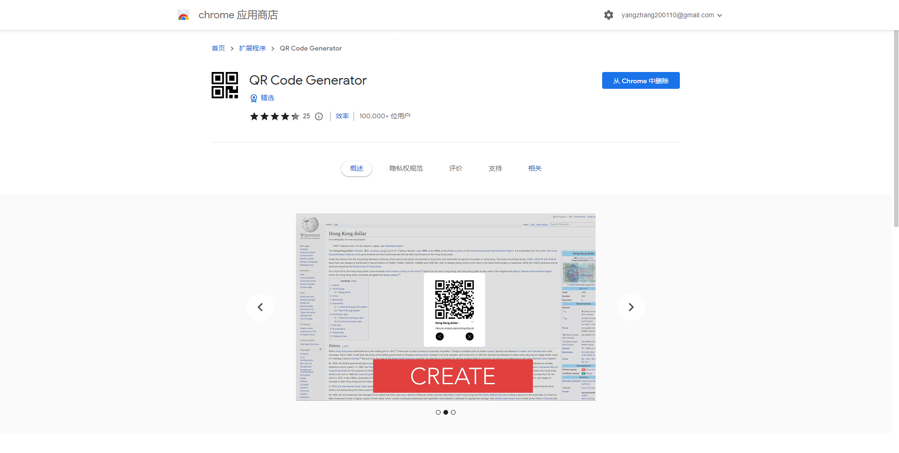
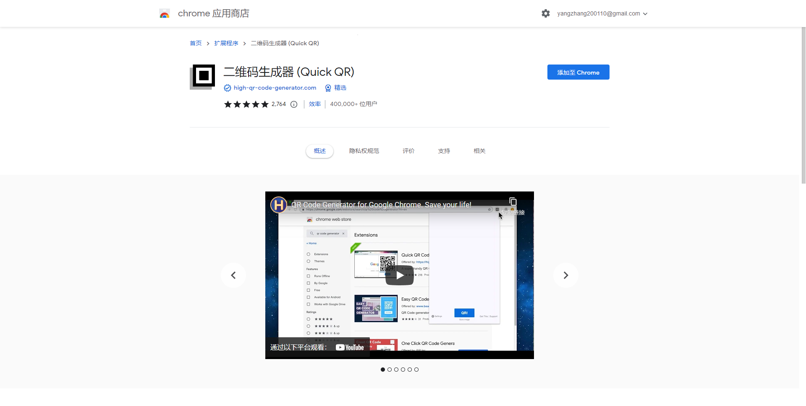

# QRQ

- 本项目是一个针对chrome浏览器开发的插件。

- 名叫**QRQ**是取了qrcode（二维码）的前两个字母（quick response的缩写），然后像qwq一样做成类似颜文字的效果。

⁽(◍˃̵͈̑ᴗ˂̵͈̑)⁽

₍ᐢ •͈ ༝ •͈ ᐢ₎♡

ฅ՞•ﻌ•՞ฅ

QRQ

## 实现的功能

- 创建二维码
  - 可以快速把当前的**网页地址**转换为二维码
  - 可以网页上的**图片**通过*右键选项* 转换为二维码
  - 可以把网页上的**文字**，选中之后通过*右键选项* 转换为二维码
  - ……
- 识别二维码
  - 可以识别网页图片中的二维码
  - （待定）可以识别浏览器之外的二维码
  - ……

## 已有的类似项目

果不其然，这样的项目已经被别人实现过了！Chrome商店里有很多二维码相关的插件，功能各异。下面简单列举几个！

- QR Code Generator

  这款实现了除了识别二维码之外几乎全部的功能。



- 二维码生成器 (Quick QR)

这一款的功能就更多了：

```
- 为当前页面生成二维码
- 为页面上任一链接生成二维码（右键点击即可）
- 输入任何内容生成二维码
- 无需联网、无需授权、代码不加密（安全可靠，童叟无欺）
- 二维码分辨率可自行设置，支持高清二维码
- 支持Logo、批量生成（点击相应按钮）
- 支持快捷键（可设置）
- 支持右键菜单（可设置）
- 可解析网页上的描任何二维码图片：6.3后新增功能，请在『设置』-『Advanced』中开启，之后便可在二维码图片上按右键，进行『解析』（也叫『扫描』）
- 可下载二维码图片，下载图片文件名中会包含尺寸信息，例如：exported_qrcode_image_350.png
```



## 但我还是要写

虽然别人做过，但是我还是想做这样一个项目。

- 一方面，虽然上面提到的插件已经实现了很多功能，但是也并非都是全能型选手（也无法根据我的个人需求高度定制），看评论区的反馈也还是有很多功能有待添加和改进。

- 另外一方面，即便是已经很完善的项目，通过复刻也能学到很多知识。*（但是本项目目前的打算是独立开发，如果实在进行不下去了才会去参考上述项目）*

毕竟，所谓的学习就是重复别人做过的事情，而后能够独立的做另外一件事情。